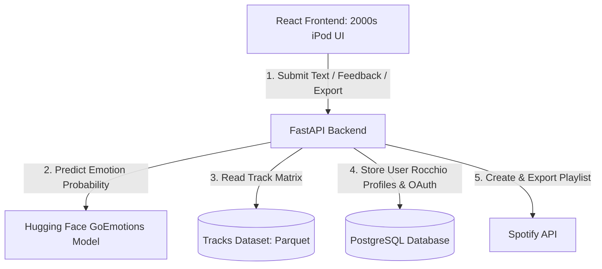

# MoodTunes Implementation Plan

## Goal Description
MoodTunes is a skeuomorphic, 2000s vintage iPod-style web application that detects user emotions from a 2-3 sentence text prompt and recommends songs from a static dataset of ~114,000 Spotify tracks (`maharshipandya/spotify-tracks-dataset`). 

The core recommendation logic is a hybrid system:
1. **Emotion Mapping:** The input text is classified using the `SamLowe/roberta-base-go_emotions` model from Hugging Face into 28 base emotions. These are mapped to a target Valence-Arousal vector using a lookup table. 
2. **Preference Profile:** A Rocchio preference profile vector is maintained for each user in the database, initialized by user-selected seed tracks, and updated based on likes (+1), dislikes/removes (-4), and skips (-0.3).
3. **Hybrid Recommendation:** A vectorized NumPy operation calculates a blended **EmotionScore** (based on Valence-Arousal proximity) and **PreferenceScore** (based on similarity to the Rocchio profile) across the 114k tracks. Tracks are filtered, ranked by a weighted combination of these scores (plus popularity), and returned as recommendations.
4. **Spotify Integration:** A secondary Spotify OAuth flow enables exporting generated playlists directly to users' Spotify accounts.

---

## Project Sprints

### Sprint 1: ML Model, Dataset & Recommendation Core (Backend Core)
- **Setup & Infrastructure:** Initialize the FastAPI directory structure, virtual environment, and install dependencies.
- **Dataset Conversion & Loading:** Create a Python utility to clean the Spotify Tracks CSV and convert it to a lightweight binary `.parquet` file. Implement memory-mapped loading at FastAPI startup, representing the dataset features as normalized NumPy vectors.
- **Emotion Classification Pipeline:** Write the Hugging Face `SamLowe/roberta-base-go_emotions` model loading pipeline, the Valence-Arousal lookup mapping, and the 7-vibe categorization module.
- **Vectorized Recommender Engine:** Develop the core algorithm that blends `EmotionScore` and `PreferenceScore` using vector operations in NumPy. Implement user onboarding seed profile setup.
- **Sprint 1 Verification:** Core recommendation unit tests showing search, user-vibe mapping, and recommendation computation in <100ms.

### Sprint 2: Database, User Auth & Spotify API (Backend Integration)
- **Database & Migration Setup:** Configure PostgreSQL using SQLAlchemy. Create DB schemas for users, interaction logs, Rocchio preference vectors, and credentials.
- **User Authentication:** Implement JWT-based signup and login endpoints.
- **Interaction Tracker & Rocchio Updates:** Build API endpoints for recording Likes (+1), Dislikes/Removes (-4), and Skips (-0.3) that update the user's Postgres preference vector.
- **Spotify OAuth & Playlist Export:** Set up the standard OAuth 2.0 Authorization Code Flow. Encrypt access/refresh tokens in Postgres. Build the background mechanism to refresh expired tokens and export user playlists.
- **Sprint 2 Verification:** Integrations verified via Swagger UI/Postman demonstrating persistent preferences and correct playlist generation on a test Spotify account.

### Sprint 3: Skeuomorphic iPod Frontend & End-to-End integration (Frontend & Polish)
- **Skeuomorphic UI Construction:** Build a pixel-perfect 2000s iPod interface in React using CSS grids, custom vintage typography, and glassmorphic styling.
- **Rotary Click-Wheel Interaction:** Implement custom mouse/gesture event listeners in JavaScript to track circular movements on the iPod click-wheel, driving screen menu scrolling.
- **Retro Screen Workflows:** Create screens for:
  - Account Sign-in/Registration
  - Initial 3-song Seed Selection (Onboarding)
  - Text Prompt Input & Vibe Override Preview
  - Player/Recommendation Deck (with Like, Dislike, Skip features)
  - Spotify Export Settings
- **End-to-End Integration:** Connect the React frontend to the FastAPI backend API. Run manual walkthroughs of the whole application experience.
- **Sprint 3 Verification:** Full local deployment showing functional skeuomorphic click-wheel navigation, mood text parsing, interactive preference learning, and direct playlist creation.

---

## User Review Required

> [!IMPORTANT]
> **Data Preparation (Kaggle Dataset):** 
> The application relies on `maharshipandya/spotify-tracks-dataset` (stored as `dataset.csv` or converted to `dataset.parquet`). We will need to include a setup script that:
> 1. Prompts the user to place the downloaded CSV file in `backend/data/`.
> 2. Clean and convert the dataset into a binary `.parquet` format for lightning-fast memory mapping and NumPy operations at startup.

> [!TIP]
> **GoEmotions-to-Vibe Mapping UI:**
> The UI will display one of the 7 main "Vibes" (e.g., *Main Character Energy*, *Heartbreak & Healing*) as a preview below the text box. The user can click this preview to override the vibe manually. This override will update the target Valence-Arousal vector using the average coordinates of the selected vibe's constituent emotions.

---

## Proposed Changes

We will build the application using **FastAPI (Python)** for the backend and **Vite + React (TypeScript/JavaScript)** for the frontend.

### Backend (FastAPI)

#### [MODIFY] [requirements.txt](file:///c:/Users/rutuc/OneDrive/Desktop/projects/mood_base/backend/requirements.txt)
Define backend python dependencies:
* `fastapi`, `uvicorn` (API Server)
* `pandas`, `pyarrow` (Parquet loading)
* `numpy`, `scipy` (Rocchio and similarity calculations)
* `transformers`, `torch` (Hugging Face emotion inference)
* `sqlalchemy`, `psycopg2-binary`, `alembic` (Postgres ORM and migrations)
* `cryptography` (For encrypting Spotify access/refresh tokens in Postgres)
* `python-jose[cryptography]` (User Authentication)
* `passlib[bcrypt]` (User Credentials hashing)
* `requests` (Spotify API integrations)

#### [NEW] [config.py](file:///c:/Users/rutuc/OneDrive/Desktop/projects/mood_base/backend/app/config.py)
Configuration settings (database URL, Spotify credentials, JWT secrets, Hugging Face model cache directory, encryption keys).

#### [NEW] [database.py](file:///c:/Users/rutuc/OneDrive/Desktop/projects/mood_base/backend/app/database.py) and [models.py](file:///c:/Users/rutuc/OneDrive/Desktop/projects/mood_base/backend/app/models.py)
* **PostgreSQL Models:**
  * `User`: `id`, `email`, `hashed_password`, `created_at`.
  * `SpotifyCredentials`: `user_id`, `encrypted_access_token`, `encrypted_refresh_token`, `expires_at`.
  * `UserPreference`: `user_id`, `rocchio_vector` (serialized array of features: valence, energy, danceability, acousticness, instrumentalness, liveness, tempo).
  * `UserInteraction`: `user_id`, `track_id`, `interaction_type` (like, dislike, skip), `timestamp`.

#### [MODIFY] [emotion.py](file:///c:/Users/rutuc/OneDrive/Desktop/projects/mood_base/backend/app/ml/emotion.py)
* Initialize Hugging Face pipeline for `SamLowe/roberta-base-go_emotions`.
* Define the `VALENCE_AROUSAL_LOOKUP` for the 28 GoEmotions.
* Define `MOOD_MAPPING` to aggregate the 28 emotions into the 7 user-facing vibes.
* Method to parse 2-3 sentence inputs and return the weighted Valence-Arousal target point.

#### [MODIFY] [recommender.py](file:///c:/Users/rutuc/OneDrive/Desktop/projects/mood_base/backend/app/ml/recommender.py)
* Load Parquet file into memory at startup. Keep features in a NumPy matrix for vectorized math.
* Normalize track features (Valence, Energy, Danceability, Acousticness, Instrumentalness, Liveness, Tempo).
* Implement the Rocchio feedback update.
* Implement hybrid score calculation.

#### [NEW] [spotify.py](file:///c:/Users/rutuc/OneDrive/Desktop/projects/mood_base/backend/app/services/spotify.py)
* Standard Spotify OAuth2 code exchange.
* Encrypted Token storage and silent auto-refresh flow using Python `cryptography`.
* Playlist creation and track exporting via `/playlists` and `/playlists/{id}/tracks` endpoints.

#### [MODIFY] [main.py](file:///c:/Users/rutuc/OneDrive/Desktop/projects/mood_base/backend/app/main.py)
Define API endpoints:
* `/auth/signup`, `/auth/login`
* `/songs/search` (Search the static dataset for seed selection)
* `/recommendations` (Takes text input, returns top-N tracks matching emotion + preference profile)
* `/interactions` (Receives like/dislike/skip events, updates Rocchio vector in database)
* `/spotify/connect`, `/spotify/callback`
* `/spotify/export` (Creates a playlist in Spotify with recommended songs)

---

### Frontend (React + Vite)

We will build the frontend inside `frontend` using React and Tailwind/Vanilla CSS to design a pixel-perfect **skeuomorphic vintage iPod Classic**.

#### [NEW] [iPod UI Design]
* **iPod Body:** Metallic silver or glossy white chassis.
* **iPod Screen:** Monochrome grey-blue LCD or early color screen styled with retro fonts (e.g., Chicago or San Francisco Mono), a top battery/play status bar, and a sidebar navigation.
* **Physical Click Wheel:** 
  * Scroll wheel that users can "rotate" or click (Menu, Play/Pause, Forward, Backward, and Select button in the center).
  * We will add standard wheel rotation gesture listeners in JS/CSS so the user can spin the wheel to scroll through playlists/menus!

---

## Verification Plan

### Automated Tests (Backend)
1. **Recommendation Logic Test:** Test recommendations with simulated Rocchio vectors to verify that cosine similarity operates on the matrix in <100ms.
2. **Emotion Classifier Mock Test:** Verify text input maps to expected valence-arousal ranges and vibe aggregates.
3. **Token Encrypt/Decrypt Test:** Verify encryption keys lock/unlock tokens correctly in the Postgres layer.

### Manual Verification
1. **Interactive Click Wheel:** Manually test scrolling interactions on the frontend click-wheel components across desktop browsers.
2. **Spotify Export:** Run standard local integration testing with a Spotify developer sandbox account to verify playlist creation.
